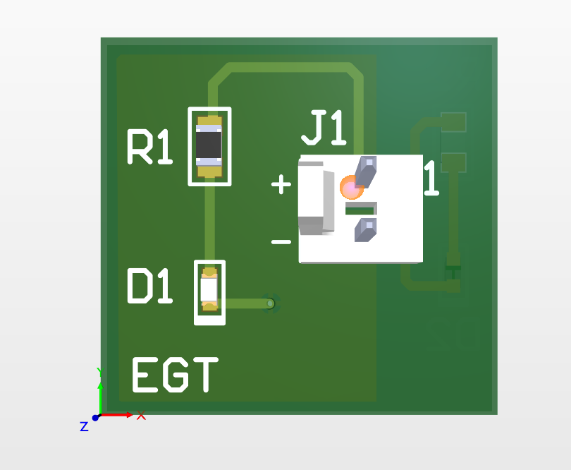

# LED PCB — Altium Designer Tutorial Project

A simple two-layer PCB designed to drive a green LED, built while learning Altium Designer's full workflow — schematic capture, footprint creation, PCB layout, polygon pours, and manufacturing outputs.

## What's Included
- `LED_Tutorial.PrjPcb` — Altium project file
- `LED.SchDoc` / `LED.SchLib` — Schematic and custom schematic library
- `LED.PcbDoc` / `LED.PcbLib` — PCB layout and custom footprint library
- `LED_Job.OutJob` — Output job file for generating manufacturing files (Gerbers, drill files, etc.)
- `3D models/` — 3D component models used in the layout
- `Project Outputs for LED_Tutorial/` — Generated manufacturing outputs
- `_Previews/` — PCB/schematic preview renders

## Skills Practiced
- Schematic capture and component symbol creation
- Custom footprint design using the IPC Footprint Wizard
- PCB layout, routing, and layer stack management
- Polygon pour / copper fill configuration
- Solder mask expansion and pad stack properties
- BOM generation
- Manufacturing output generation (Gerbers/drill files)

## Tools Used
- Altium Designer
